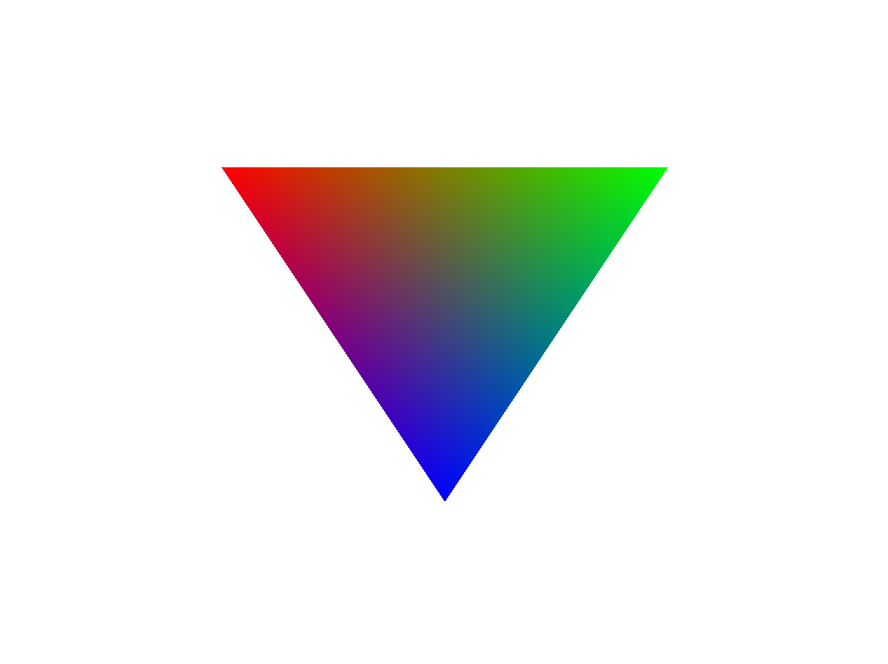

# Vulkano Triangle Example

A simple rainbow triangle using Rust and Vulkan via [vulkano](https://github.com/vulkano-rs/vulkano) bindings.




Made with help from [this video](https://www.youtube.com/watch?v=8iEN64bj3X4).


## Quickstart:
```
cargo run
```

## Note: 
```
Only use dependency versions mentioned in Cargo.toml file as newer versions have deprecated some functions.
```
